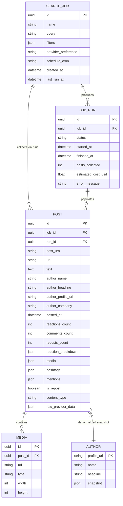
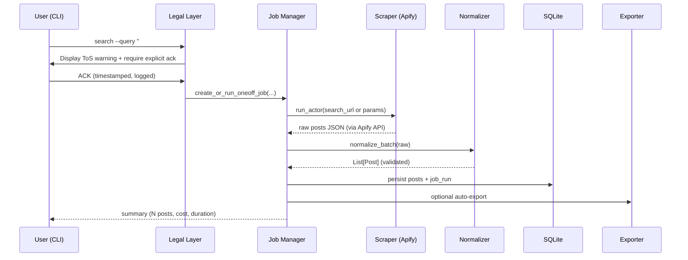

# Design Document: LinkedIn Post Search & Collection Application (LIPSA)

**Author**: Engineering Team (placeholder)  
**Date**: 2026-05-27  
**Status**: Draft  
**Document ID**: 08598f72  
**Version**: 0.1  

---

## Overview

The LinkedIn Post Search & Collection Application (LIPSA) is a local-first Python application that enables researchers, marketers, analysts, and recruiters to discover, filter, collect, and export structured data from public LinkedIn posts matching keyword or hashtag queries. 

LinkedIn provides no official public API for general keyword or hashtag search across public posts (Marketing Developer Platform and Community Management APIs are restricted to authorized organization content, posting, and analytics on *owned* assets). General discovery therefore requires either commercial managed scraping services or self-managed browser automation. LIPSA solves this by providing a safe, auditable, and user-controlled interface primarily backed by commercial providers (Apify LinkedIn Post Search actors and Bright Data LinkedIn scrapers), with strong legal/ethical guardrails, support for both one-off interactive use and recurring scheduled collection, rich filtering, canonical data normalization, local persistence, and flexible exports (CSV/JSON/Excel).

As of initial exploration on 2026-05-27, the workspace root ("LinkedIn Post Scraper" at `C:\Users\SBAGCHI\OneDrive - Altera Digital Health\Documents\GitHub\LinkedIn Post Scraper`) contained **zero files**; only an empty `design/` subdirectory was present (confirmed via `list_dir` and PowerShell `Get-ChildItem -Recurse -Force` yielding a file count of 0).

---

## Background & Motivation

LinkedIn's public post search (keyword, hashtag, date, author facets) is a powerful discovery surface for competitive intelligence, trend monitoring, academic research, content strategy, and talent sourcing. However:

- **Official API reality (2026)**: No endpoint exists for broad public post search by keyword or hashtag. Available capabilities (Community Management / Posts API, Share Statistics, Organization Insights, new 2025 Company Intelligence API) are limited to *your own or authorized organization pages*, mentions of your brand, and analytics. Self-serve developer access is narrow; Marketing Developer Platform requires partner approval with strict use-case review. See developer.linkedin.com product catalog and analyses of the "LinkedIn API Gap" (updated May 2026).
- **ToS and enforcement**: LinkedIn User Agreement (Section 8.2 "Don’ts", effective Nov 2025) explicitly prohibits "software, devices, scripts, robots or any other means... to scrape or copy the Services", bots, automated methods, and inauthentic engagement. Crawling Terms (2017, still referenced) require express permission. Violations lead to account bans, IP blocks, and legal action. Recent enforcement includes the 2025 Proxycurl-related shutdown and GDPR fines (e.g., KASPR €240,000 by CNIL in early 2025).
- **Technical reality**: Self-managed automation (Playwright/Puppeteer + stealth) faces aggressive fingerprinting, behavioral detection, frequent DOM/Voyager API changes (every 2–8 weeks), login walls, CAPTCHAs, and low safe throughput (<50–100 actions/account/day common in community reports). Maintenance burden is high.
- **Commercial options**: Mature solutions exist. Apify offers multiple high-rated "LinkedIn Post Search Scraper" actors (e.g., `harvestapi/linkedin-post-search` 5.0 rating, 12K+ users, no-cookies variants; `supreme_coder/linkedin-post` 4.8 rating, ~$1/1K posts). Bright Data provides maintained LinkedIn scrapers (posts + profiles + companies) with residential proxies, pay-per-success pricing (~$0.70–$2.50/1K records), SOC 2 / GDPR certifications, and strong uptime. Oxylabs restricts LinkedIn access (mandatory KYC for all customers + restricted target process for their Web Scraper API); ScrapingBee supports public (non-authenticated) LinkedIn scraping via its HTML/JS rendering + proxy API but explicitly prohibits authenticated/logged-in sessions per its AUP (updated 2025). All provider comparisons should be re-verified against latest documentation before implementation.
- **User pain**: Ad-hoc scripts break constantly; commercial tools are fragmented; no integrated scheduling + filtering + export + audit for non-engineers; legal exposure is rarely surfaced explicitly in tooling.

LIPSA exists to give target users a single, responsible, maintainable tool while making the legal and technical trade-offs explicit and auditable.

---

## Goals & Non-Goals

### Goals
- Enable keyword and hashtag search of public LinkedIn posts with filters (date posted, minimum engagement, author type/facets, content type, sort order) mirroring and extending LinkedIn UI capabilities.
- Collect structured post data: URL/URN, full text, author (name, headline, profile URL, company/industry where available), posted timestamp, reaction/comment/repost counts + breakdowns, media/attachments, hashtags/mentions, repost flag, content type.
- Support one-off interactive execution and recurring/scheduled jobs (cron-style) with local job history and results.
- Provide multiple export formats (CSV with flattened + JSON columns, JSON/NDJSON, Excel with formatting, optional Parquet) and destinations (local filesystem, Google Sheets via API).
- Offer configurable collection backends with a strong default preference for commercial providers; abstraction layer for future providers.
- Surface legal, ToS, and ethical risks prominently with mandatory acknowledgments, audit logging, and data-minimization features.
- Keep all collected data local by default (user owns and controls it); minimal external dependencies beyond chosen provider APIs.
- Target <5 minute end-to-end for a 500-post search via commercial backends; storage footprint <50–100 MB for typical researcher workloads (hundreds of jobs/year).

### Non-Goals (v1)
- No support for private posts, full private profiles, or authenticated member data beyond public views.
- No automated engagement actions (likes, comments, reposts, connection requests, messaging).
- Not a hosted multi-tenant SaaS product (liability and compliance surface would be significantly higher).
- No built-in email/phone enrichment or contact list building (separate high-risk category).
- No native sentiment analysis, topic modeling, or ML pipelines (export for external tools).
- No support for Sales Navigator-only advanced filters in v1 (complementary tool recommended for users with SN licenses).
- No real-time streaming or webhook ingestion of all posts (query-driven only).

---

## Proposed Design

### High-Level Approach
LIPSA is a **local-first hybrid application** with commercial providers as the **primary, recommended collection mechanism**. Self-managed browser automation (Playwright) is implemented behind a feature flag, disabled by default, and gated behind multiple explicit risk acknowledgments.

**Primary recommended backends (v1)**:
- Apify (preferred for search UX): Use no-cookie LinkedIn Post Search Scraper actors (`harvestapi/linkedin-post-search`, `supreme_coder/linkedin-post`, etc.) that accept search URLs or keywords + filters and return structured JSON.
- Bright Data (secondary for reliability/scale): Dedicated LinkedIn Web Scraper endpoints for posts.

The application normalizes provider-specific output into a canonical schema, stores results locally, and supports rich post-filtering (e.g., min reactions) even when the provider does not expose the filter natively.

### Architecture

```mermaid
graph TD
    subgraph "User Interfaces"
        CLI[CLI (Typer + Rich)]
        Web[Optional Local Web UI<br/>FastAPI + HTMX/Static]
    end

    subgraph "Core Application"
        JobMgr[Job Manager &amp; Scheduler<br/>(APScheduler)]
        Legal[Legal &amp; Consent Layer]
        Config[Config &amp; Secrets<br/>(keyring + YAML)]
    end

    subgraph "Scraper Abstraction"
        Interface[ScraperBackend Protocol<br/>search_posts(query, filters) → List[RawPost]]
        Apify[ApifyBackend<br/>(apify-client + Actor runs)]
        Bright[BrightDataBackend<br/>(REST + datasets)]
        Self[SelfPlaywrightBackend<br/>(feature-flagged, warned)]
    end

    subgraph "Processing &amp; Storage"
        Norm[Normalizer &amp; Validator<br/>(Pydantic models)]
        DB[(SQLite<br/>~/.lipsa/lipsa.db)]
        FS[Local Filesystem<br/>(exports/, raw/)]
    end

    subgraph "External"
        ApifyCloud[Apify Cloud Platform]
        BrightInfra[Bright Data Infrastructure<br/>(residential proxies, unlocker)]
        LinkedIn[(LinkedIn.com<br/>Public content only)]
    end

    CLI --> Legal
    Web --> Legal
    Legal --> JobMgr
    JobMgr --> Interface
    Interface --> Apify
    Interface --> Bright
    Interface --> Self
    Apify --> ApifyCloud
    Bright --> BrightInfra
    ApifyCloud &amp; BrightInfra --> LinkedIn
    Interface --> Norm
    Norm --> DB
    Norm --> FS
    JobMgr --> Exporter[Exporter]
    Exporter --> FS
```

**Data Model (ER Diagram)**



**Note on Canonical Data Model alignment**: The Pydantic `Post` model (below) and ERD are now kept in sync. `mentions` is stored as a JSON array on POST (consistent with `hashtags` and real provider outputs). The separate `AUTHOR` table provides an optional normalized lookup (by `profile_url`) for cross-job profile enrichment/analytics or deduplication; the primary path remains denormalized snapshots on POST for simplicity and audit fidelity in a local single-user tool. Sparse fields (e.g., `author_company`, some reaction breakdowns) are common in Apify/Bright Data responses and are tolerated as NULL/empty in both model and schema. `audit_events` is defined in the Storage Schema subsection under Data Model Changes.

### Key Components & File Layout (proposed)

```
src/
├── cli/
│   ├── main.py                 # Typer app entry
│   ├── commands/
│   │   ├── search.py
│   │   ├── jobs.py
│   │   └── export.py
├── web/
│   ├── app.py                  # FastAPI (optional, localhost-only)
│   └── templates/...
├── scrapers/
│   ├── base.py                 # ScraperBackend protocol + common types
│   ├── apify.py
│   ├── brightdata.py
│   └── playwright.py           # Feature-flagged
├── models/
│   ├── post.py                 # Pydantic Post, Author, Media, Filters
│   └── job.py                  # SearchJob, JobRun
├── storage/
│   ├── db.py                   # SQLAlchemy engine + session
│   └── repositories.py
├── scheduler/
│   └── aps.py
├── exporters/
│   ├── csv.py
│   ├── excel.py
│   └── sheets.py
├── legal/
│   ├── disclaimer.py           # Mandatory text + ack functions
│   └── audit.py                # Structured logging of consents + queries
└── config.py
```

**Canonical Post Model (excerpt)**

```python
from pydantic import BaseModel, HttpUrl
from datetime import datetime
from typing import List, Optional, Dict

class Post(BaseModel):
    post_urn: str
    url: HttpUrl
    text: str
    author_name: str
    author_headline: Optional[str] = None
    author_profile_url: HttpUrl
    author_company: Optional[str] = None
    posted_at: datetime
    reactions_count: int = 0
    comments_count: int = 0
    reposts_count: int = 0
    reaction_breakdown: Dict[str, int] = {}
    media: List[Dict] = []
    hashtags: List[str] = []
    mentions: List[str] = []
    is_repost: bool = False
    content_type: str = "text"  # text|image|video|article|poll|...
    raw_provider_data: Dict  # full fidelity for debugging
```

### Job Execution Flow (One-off)



Scheduled jobs follow the same path but are triggered by APScheduler (in-process, persisted) or external cron invoking the CLI with `--job-id`. See the dedicated "Scheduling & Job Persistence" subsection below for the exact consent, persistence, and startup model (chosen to eliminate any "silent" execution without prior explicit user acknowledgment).

### Scheduling & Job Persistence

**Chosen model (resolves legal/operational conflict with "no silent/background" and per-run consent requirements)**: One-time interactive consent at *job creation or edit time*, with a versioned snapshot of the current disclaimer text and user acknowledgment stored against the `SEARCH_JOB` record. Recurring executions (via APScheduler or external cron) replay the stored consent record. On any disclaimer update (detected at startup or job edit), the CLI/web UI forces re-acknowledgment before the job can be (re)scheduled or run. This satisfies "explicit user acknowledgment" without requiring a human present at every cron tick, while preserving a defensible immutable audit trail.

**Implementation details**:
- Primary execution path: In-process APScheduler using SQLAlchemyJobStore (jobs persisted in the same SQLite DB as `search_jobs.schedule_cron`). At app/CLI startup (or web lifespan), all active jobs with valid stored consent are loaded and scheduled.
- Alternative path: Pure external cron (OS scheduler or systemd timer) invoking `lipsa jobs run <id>` (or equivalent). Still requires the stored consent record to exist and be current.
- Missed runs: APScheduler `misfire_grace_time` + logging to `job_runs` with status `MISSED`. External cron relies on OS logging.
- Concurrency: CLI invocations of a scheduled job are serialized via DB locks; web UI shows "job already running" for long-running executions.
- Consent storage: `audit_events` rows with `event_type='consent_ack'` + `disclaimer_version` + `user_ack` reference the job. The `SEARCH_JOB` record also caches the last acknowledged disclaimer version.
- First-run and job creation flows: Interactive prompts (or web forms) capture ack before persisting the cron schedule.
- No background daemon by default for the CLI; users run the scheduler via `lipsa scheduler start` (foreground with hot-reload of jobs from DB) or integrate with OS service managers. The optional web UI can run as a long-lived process.

This model was selected over "per-execution interactive consent" (incompatible with recurring) or "fire-and-forget in-memory APScheduler" (violates auditability and "no silent" principle). External cron remains fully supported for environments that prefer it.

### Filter Application, Pagination & Cost Safeguards

The design supports rich client-side post-filtering (e.g., `--min-reactions`) even when the provider backend does not natively expose the filter. This is implemented with explicit cost and correctness safeguards.

**Core strategy (decision table)**:

- **Provider-native filters first**: Date ranges, basic keywords, author/company facets, content type, and sort order are translated directly into the provider's input schema (or search URL) to minimize fetched volume. Example Apify actor mappings (for common no-cookie post search actors):
  - `--date-from` / `--date-to` → actor `datePosted` or search URL `f_TPR` / time range params (or `start`/`end` timestamps where supported).
  - Author type / company → `authorType`, `companyUrn`, or search facet params.
  - Content type → where exposed by the actor.
- **Client-side post-filtering for engagement**: `--min-reactions`, `--min-comments`, etc., are applied in the Normalizer after fetching. To control cost:
  - Conservative over-fetch factor (default 1.5–2.0× the requested `max_results`, capped by a hard global `--max-fetch` of 2000 per job in v1).
  - Early termination: If the provider supports "relevance" or "latest" sort + pagination, fetch pages until the desired number of *passing* posts is reached or a safety cap.
  - Sampling warning: For very broad queries, a `--dry-run --estimate-only` mode queries the provider for approximate result count (where available) or performs a small sample run and extrapolates.
- **Hard caps and warnings**:
  - Absolute max results per job: 5000 (configurable via `config.yaml`).
  - Pre-execution estimate (best-effort): CLI/web shows "Estimated records to fetch: ~1200 (provider) + client filter → ~650 results. Est. cost: $2.10 (Apify) / $1.80 (Bright). Proceed? [y/N]".
  - Cost tracking: `estimated_cost_usd` populated in `JOB_RUN` from provider response metadata (Apify run statistics / dataset billing events; Bright Data pay-per-success headers/responses). Actual vs. estimate logged for calibration.
- **Pagination**: Providers typically return ~50–100 posts per page. The backends implement cursor/page iteration with rate-limit backoff. Raw pages are optionally retained in `raw/` for debugging.

**Pseudocode (simplified)**:

```python
def execute_search(query, filters, provider, max_results):
    native_filters = translate_to_provider(filters)  # date, facets, etc.
    fetch_target = min(max_results * 2, HARD_MAX_FETCH)
    raw = provider.search(query, native_filters, limit=fetch_target)
    normalized = [normalize(p) for p in raw]
    filtered = [p for p in normalized if passes_client_filters(p, filters)]  # min_reactions etc.
    return filtered[:max_results]
```

Dry-run and estimate modes are required deliverables in PR #4 / PR #6. This keeps the quantified targets ("<5 min for 500-post search", "$5–40/mo") credible while protecting users from surprise costs or incomplete results.

### Configuration & Secrets
- Provider API tokens: stored via `keyring` (OS secure storage) or encrypted YAML.
- All runs (one-off or recurring) require a prior explicit user acknowledgment of risks for that job definition (stored in `audit_events` with query hash + timestamp + version of disclaimer text). Recurring jobs use the versioned snapshot captured at definition time (with forced re-ack on updates).
- Feature flag `ENABLE_SELF_SCRAPER=false` by default in `config.yaml`.

### Quantified Expectations (typical researcher workload)
- 10–30 searches/month, 200–2,000 posts per search.
- Commercial cost: $5–40/month at Apify/Bright rates for moderate use.
- Local SQLite growth: ~5–15 KB per post (with raw); 100 MB/year typical.
- One-off latency (commercial): 30s–4 min for 500 posts.
- Self-managed: 5–20× slower + higher variance.

---

## API / Interface Changes

LIPSA is primarily a CLI application with an optional localhost-only web UI. No public HTTP API is exposed.

**CLI interface (examples)**:

```bash
# One-off (requires prior provider config + legal ack)
lipsa search "#generative-ai" --date-from 2026-04-01 --min-reactions 100 --max-results 800 --provider apify --export csv:results.csv

# Create recurring job
lipsa jobs create "Competitor monitoring" --query "climate tech" --schedule "0 9 * * MON" --filters '{"min_reactions":50}' --provider brightdata

# List / run / export history
lipsa jobs list
lipsa jobs run <job-id>
lipsa export --job-id <id> --format excel
```

The web UI (when enabled) mirrors the same operations via forms and a job history table. Internal "API" consists of the `ScraperBackend` protocol and repository methods (no breaking external contracts in v1).

---

## Data Model Changes

### Storage Schema (complete, aligned with Pydantic models and ERD)

New SQLite schema (Alembic migrations; initial migration creates all tables with the definitions below):

- `search_jobs`, `job_runs`, `posts`, `media`, `authors` (optional normalized lookup), `audit_events` (immutable log of queries + acknowledgments + deletions + consent records).

**Key tables (excerpted; full DDL in migration):**

```sql
CREATE TABLE posts (
    id TEXT PRIMARY KEY,
    job_id TEXT,
    run_id TEXT,
    post_urn TEXT,
    url TEXT,
    text TEXT,
    author_name TEXT,
    author_headline TEXT,
    author_profile_url TEXT,
    author_company TEXT,
    posted_at DATETIME,
    reactions_count INTEGER DEFAULT 0,
    comments_count INTEGER DEFAULT 0,
    reposts_count INTEGER DEFAULT 0,
    reaction_breakdown JSON,
    media JSON,
    hashtags JSON,
    mentions JSON,                 -- Added for alignment with Pydantic model
    is_repost BOOLEAN DEFAULT 0,
    content_type TEXT,
    raw_provider_data JSON
);

CREATE TABLE authors (
    profile_url TEXT PRIMARY KEY,
    name TEXT,
    headline TEXT,
    snapshot JSON
    -- Optional normalized lookup for cross-job enrichment/dedup; primary data remains denormalized on posts
);

CREATE TABLE audit_events (
    id TEXT PRIMARY KEY,
    timestamp DATETIME NOT NULL,
    event_type TEXT NOT NULL,           -- e.g., 'job_created', 'consent_ack', 'search_executed', 'data_deleted', 'disclaimer_updated'
    job_id TEXT,
    query_hash TEXT,
    disclaimer_version TEXT,
    user_ack TEXT,                      -- e.g., 'accepted_v2026-05-27' or full text hash
    details JSON
    -- Immutable; append-only for legal defensibility
);
```

- Posts table includes `raw_provider_data` JSON for fidelity and future re-processing. Sparse provider fields (e.g., `author_company` often absent or nested) are stored as NULL/empty and tolerated.
- No user accounts or multi-tenancy tables (single local user).
- Soft-delete + purge commands for data subject requests.
- Indexes (including composites for common queries):
  - `CREATE INDEX idx_posts_posted_at ON posts(posted_at);`
  - `CREATE INDEX idx_posts_job_id ON posts(job_id);`
  - `CREATE INDEX idx_posts_author_profile_url ON posts(author_profile_url);`
  - `CREATE INDEX idx_posts_job_posted ON posts(job_id, posted_at);`
  - `CREATE INDEX idx_audit_events_job_timestamp ON audit_events(job_id, timestamp);`
  - `CREATE INDEX idx_audit_events_type ON audit_events(event_type);`
- SQLite pragmas for concurrency (used by both CLI and optional web UI): `WAL` journal mode + `busy_timeout=5000`. Connection pooling / `check_same_thread=False` (with proper locking) in SQLAlchemy engine configuration.

Migration strategy: Alembic with autogenerate + hand-reviewed migration files for the initial full schema (including `mentions`, `audit_events`, and `authors`). Users can `lipsa db backup` / restore. A "Storage Schema" subsection in the design now keeps ERD, Pydantic models, and DDL in sync.

---

## Alternatives Considered

**1. Pure self-managed browser automation (Playwright + advanced stealth patches, residential proxies, CAPTCHA solvers)**  
*Trade-offs*: Zero marginal per-post cost after infra; maximum control and customization.  
*Downsides*: Extremely high maintenance (DOM changes break selectors weekly), high ban rates even with best practices (fingerprinting + behavioral ML), non-trivial infrastructure cost (proxies $10–100+/mo + CAPTCHA credits), steep expertise requirement, and maximal legal exposure (direct ToS violation + potential CFAA/privacy arguments). Unsuitable for recurring production use by target non-engineer users. Rejected as primary path.

**2. Hosted multi-user SaaS web application**  
*Trade-offs*: Polished UX, always-on scheduling, team sharing, easier distribution.  
*Downsides*: The operator becomes a data processor for all user-collected LinkedIn personal data (names, posts, engagement), dramatically increasing GDPR/CCPA liability, ToS enforcement risk against the service itself, and operational burden (auth, billing, data residency, incident response). Misaligned with individual researcher preference for local data ownership. Rejected for v1.

**3. Sales Navigator exports + third-party cleaners (Evaboot, Lobstr, etc.)**  
*Trade-offs*: Lower technical ban risk (uses official export), good for recruiter workflows.  
*Downsides*: Requires expensive LinkedIn Sales Navigator license; search scope limited to SN's advanced filters and network; does not support arbitrary public hashtag/topic searches across all public posts; still subject to LinkedIn ToS on automation of the export process in some interpretations. Valuable complement, not a complete solution.

**4. Pre-purchased or subscription datasets from data providers**  
Good for static historical snapshots or broad enrichment, but useless for fresh monitoring or custom recurring queries. Not a replacement.

**Selected approach**: Commercial-primary hybrid local application (Apify + Bright Data backends with abstraction). Best balance of reliability, cost, maintainability, and (relatively) reduced direct technical risk while keeping data and liability surface with the end user.

---

## Security & Privacy Considerations

**Threat model**:
- Local machine compromise (user responsibility).
- Provider API key leakage (mitigated by OS keyring + short-lived tokens where possible).
- Malicious or accidental over-collection (mitigated by query scoping, post-filters, max_results hard caps, and audit).
- Provider-side data exposure (commercial providers claim strong controls; users should review their DPA).

**Controls**:
- All external calls over HTTPS/TLS.
- No telemetry or phone-home by default (opt-in anonymous usage stats only).
- Secrets never logged or stored in plaintext.
- Local SQLite file permissions respected; user can encrypt volume. When both CLI and optional web UI run concurrently, the SQLAlchemy engine uses `check_same_thread=False` + WAL mode + busy_timeout (see Storage Schema); connection pooling is configured for safe shared access.
- PII (author names, headlines, post text) is treated as personal data. Application never sends raw data to third parties except the chosen scraping provider for the explicit collection task.
- Built-in commands: `lipsa data delete --job-id X`, `lipsa data purge --older-than 90d`.

**Local Web UI Considerations** (localhost-only): Default port 8765 (configurable). uvicorn/FastAPI lifespan hooks load APScheduler jobs from DB. CORS restricted to localhost origins. Optional Prometheus `/metrics` endpoint is gated behind `ENABLE_PROMETHEUS` flag and localhost binding. Long-running jobs from the UI are tracked in `job_runs` with status polling. Feature flag `ENABLE_WEB_UI` is enforced at import/startup (module raises or UI disabled if false). All legal/consent flows are identical to CLI. See PR #8 for implementation surface.

**Auth**: None (single local user). Web UI binds only to 127.0.0.1.

---

## Observability

- Structured JSON logging (structlog) to file + console. Every search and job run produces an auditable event including query, filters, provider, post count, duration, cost, and consent reference.
- Job metrics persisted in `job_runs` (posts_collected, estimated_cost_usd, error).
- Progress bars and live counters in CLI (Rich).
- Web UI (optional) shows real-time job status and history table.
- Optional Prometheus `/metrics` endpoint when running web mode.
- Scheduled job failures can trigger email/webhook notifications (user-configured SMTP or Slack/Teams webhook).
- No external APM dependency in core (users may add their own).

---

## Rollout Plan

- **Phase 0 (pre-alpha)**: Design + legal review by counsel. Heavy internal disclaimers.
- **Alpha (PRs 1–5)**: CLI + Apify backend + models + one-off + basic export. Mandatory legal ack on every run. Limited to 3–5 trusted pilot users who sign explicit risk acknowledgment.
- **Beta (PRs 6–8)**: Add scheduler, Bright Data backend, optional web UI, self-scraper (disabled default). Feature flag `ENABLE_SELF_SCRAPER`. Expand pilot to 20 users with legal review.
- **GA (subsequent)**: Packaging (pip + optional PyInstaller/briefcase standalone), comprehensive docs, export to Google Sheets, more exporters. Public README with prominent legal warning.
- **Feature flags**: `ENABLE_SELF_SCRAPER`, `ENABLE_WEB_UI`, `AUTO_EXPORT_ON_RUN`.
- **Rollback**: Semantic versioning + uninstall script that removes only LIPSA artifacts (leaves user exports). Git tags allow easy revert of any release.
- **Monitoring**: Optional anonymous "job completed" events (provider used, post count, duration) to guide prioritization. Full opt-out supported.

---

## Open Questions

1. Default primary provider (Apify vs Bright Data) — requires small-scale cost/performance benchmark on representative hashtag searches.
2. Packaging & distribution for non-Python users (standalone executable vs `pipx` vs Tauri desktop shell).
3. Depth of collection: support for expanding top comments on high-value posts (increases cost and ToS surface).
4. Whether to offer a minimal "read-only Sales Navigator export importer" as a lower-risk complementary path.
5. Long-term: Should the project ever offer a hosted option, or remain strictly local/self-hosted?

---

## References

- LinkedIn Developer Portal / Marketing APIs: developer.linkedin.com/product-catalog
- LinkedIn User Agreement (Section 8.2) and Crawling Terms
- hiQ Labs v. LinkedIn (9th Cir. precedents and 2022 settlement)
- CNIL decision re: KASPR (2025 GDPR fine)
- LinkedIn enforcement actions (Proxycurl-related, 2025)
- Apify Store LinkedIn Post Search actors (harvestapi, supreme_coder, etc.)
- Bright Data Web Scraper / LinkedIn datasets documentation
- ScrapFly, Oxylabs, ScrapingBee blogs on LinkedIn difficulty (2025–2026)
- "LinkedIn API Gap" analyses (2026)

---

## Risks & Mitigations

**Legal / Compliance (Highest Severity)**

**Liability Model**

Users of LIPSA (and any LinkedIn data collection tooling) are the data controllers for any personal data collected and remain direct parties to LinkedIn's User Agreement. Commercial providers supply infrastructure and parsing services but explicitly shift legal responsibility downstream via their Acceptable Use Policies (AUP), Data Processing Agreements (DPAs), and terms of service. Users supply the queries, API credentials, and decide what to store/process. Precedents (e.g., CNIL enforcement against KASPR as a tool operator, LinkedIn actions against entities providing scraping services like Proxycurl in 2025) confirm that end users directing collection bear primary exposure under contract, GDPR/CCPA, and related laws. Providers typically require users to warrant lawful use and indemnify the provider. LIPSA makes this model explicit rather than creating any insulation.

- **Risk**: Direct violation of LinkedIn User Agreement (ToS) by any automated access. Consequence: account bans, cease-and-desist, civil suit for breach of contract, potential injunctions, attorney fees. Severity: **Critical**.
  - **Mitigation**: No material legal insulation is provided or claimed by commercial providers—the user remains fully responsible for ToS violations, data protection law compliance (as controller), and any downstream use of collected data. Providers' contracts and AUPs require users to warrant lawful use and often indemnify the provider. LIPSA enforces mandatory per-run (or per-job-definition for recurring—see Scheduling & Job Persistence) explicit user acknowledgment stored in an immutable audit log (with query, filters, disclaimer version, timestamp); prominent disclaimers in all UIs, README, and first-run flow; "no silent/background operation" (recurring jobs rely on prior stored consent record with version checks); clear "you are responsible" language; and a one-click "compliance package" export containing full audit trail, job definitions, and consent records for legal review or DPIA support. Self-scraper path (if enabled) carries even higher direct exposure.
- **Risk**: GDPR / CCPA / state privacy violations when collecting, storing, or using personal data from posts (names, opinions, affiliations). Fines up to 4% global turnover. Real precedent: KASPR €240k (2025). Severity: **Critical**.
  - **Mitigation**: Local storage default (user is controller); data minimization (only requested fields); easy per-job and bulk deletion; no built-in resale/sharing; purpose limitation enforced via job metadata; documentation templates for legitimate interest assessments; explicit controller/processor clarification in the Liability Model above.
- **Risk**: CFAA or equivalent claims (US) if technical circumvention or post-C&D access occurs. hiQ precedent helps only for purely public unauthenticated scraping and is circuit-limited. Severity: **High**.
  - **Mitigation**: Prefer commercial providers who handle infrastructure; self-scraper (if enabled) never uses fake accounts or circumvents after blocks; strict rate limiting and human-like pacing in any self path. Users remain responsible for any post-C&D behavior.
- **Risk**: Provider changes pricing, ToS, or reliability, or themselves face enforcement. Severity: **Medium-High**.
  - **Mitigation**: Backend abstraction + multi-provider support; documented fallback procedures; no hard dependency on single vendor. Users must review each provider's current AUP/DPA before use.

**Technical / Operational**

- Provider rate limits, actor failures, or sudden LinkedIn DOM/API changes (affects all approaches). Mitigation: retry logic with exponential backoff, dead-letter jobs, raw data retention for re-processing, monitoring of success rates.
- Self-scraper fragility and high ops cost. Mitigation: disabled by default; clear "not recommended for production" labeling; maintenance burden explicitly documented.
- Data quality / duplication across runs. Mitigation: URN-based deduplication in storage; optional "since last run" incremental collection.

**Business / Reputational**

- User misuses data for spam or harassment → reputational harm to the tool and authors. Mitigation: strong ethics section in docs; no outreach/automation features; ToS for the tool itself prohibiting abusive use.

All high-severity risks are called out in the first-run experience and every job creation flow.

---

## Data Ethics & Compliance

LIPSA is built on the following principles (inspired by GDPR, ethical scraping guidelines, and EWDCI-like frameworks):

1. **Lawfulness & Transparency**: Every collection action requires explicit user acknowledgment of LinkedIn ToS violation risk and the nature of data being collected. Full query + consent record is logged immutably.
2. **Purpose Limitation & Data Minimization**: Jobs are scoped by user-defined query + filters. Only public posts are collected. Raw provider data is retained only for fidelity and can be purged independently.
3. **User Control**: Complete local ownership. One-command deletion of any job's data or entire database. Exportable audit logs. No vendor lock-in.
4. **Accountability**: The tool never hides its actions. All external provider calls are attributable to the user's own API keys and explicit consent.
5. **Do No Harm**: The application contains no features for automated engagement, bulk unsolicited outreach, or deanonymization. Documentation strongly discourages using collected data to harass or spam.

**Built-in features**:
- Mandatory interactive consent + timestamped audit at job creation/edit time (one-time for recurring jobs using versioned disclaimer snapshot; re-ack forced on updates) and before first collection. See Scheduling & Job Persistence for the exact recurring consent model.
- `lipsa data delete` and scheduled purge policies per job.
- Export of "compliance package" (job definition + consent records + sample data schema + provider used + full audit_events for the job).
- Clear separation: the tool facilitates *access*; the user is solely responsible for subsequent lawful processing.

Users are repeatedly advised to consult qualified legal counsel for their jurisdiction, volume, and intended use of the data.

---

## Key Decisions

1. **Local-first Python CLI + optional localhost web UI (not SaaS, not pure desktop framework)**: Rationale — keeps data ownership and primary liability with the end user (critical for privacy-sensitive research use cases); dramatically lowers operator compliance burden compared to hosted service; Python is the natural language for data work and has excellent provider SDKs.
2. **Commercial providers (Apify + Bright Data) as primary collection mechanism; self-managed Playwright strictly opt-in and disabled by default**: Rationale — commercial services provide maintained parsers, residential proxies, CAPTCHA handling, and higher reliability while shifting some infrastructure and detection burden; self-scraping has proven unsustainable and maximally risky per 2025–2026 research.
3. **SQLite local storage with full raw fidelity + rich exports (no cloud DB by default)**: Rationale — matches "user owns the data" principle; zero ongoing cost or vendor dependency; sufficient performance for expected workloads (< few hundred thousand posts lifetime for most users).
4. **Scraper abstraction layer from the first implementation PR**: Rationale — enables easy addition of future providers, A/B testing, and graceful degradation if one vendor changes terms or pricing.
5. **Mandatory, auditable, per-job legal/ethical consent gates + prominent disclaimers everywhere**: Rationale — honest engineering practice given the domain; creates defensible audit trail; reduces likelihood of misuse and surprises for users.
6. **No built-in engagement automation or contact enrichment features**: Rationale — these are separate, higher-risk categories that would dramatically increase legal surface and are out of scope for a "search and collect" tool.
7. **Feature-flagged self-scraper rather than omitting it entirely**: Rationale — power users and researchers in low-risk jurisdictions may have legitimate reasons to experiment; making it available (but heavily caveated) increases transparency and reduces incentive to fork into unsafe hidden implementations. (Caveat: Ongoing maintainer burden for even a skeleton + the acknowledged high maintenance cost of a full stealth path was explicitly weighed against the "omit entirely" alternative during design; skeleton approach + clear deferral was selected for v1 to balance transparency and scope.)

**Additional decisions / non-decisions with material impact**:
- **SQLAlchemy + Alembic (with hand-reviewed migrations) vs. raw sqlite3 + hand-written migrations or ORM-less approach**: Chosen for PR #2 because it provides type-safe models, migration history, and easier long-term evolution for a data-heavy tool while remaining lightweight for SQLite. Trade-off: slightly higher initial complexity in PR #2 (addressed by explicit full schema in design).
- **APScheduler + SQLAlchemyJobStore (with external cron fallback) as primary recurring mechanism**: Selected over pure external cron or heavier task runners (Celery) for simplicity in a local-first tool. Ties directly to the Scheduling & Job Persistence model; external cron remains a supported alternative for advanced users.
- Packaging/distribution (pip vs. standalone executable) remains an Open Question with an explicit decision gate in PR #9 rather than being locked in the initial design. This allows real user feedback from alpha/beta before committing to PyInstaller, briefcase, or Tauri.

---

## PR Plan

The implementation will be delivered via small, independently reviewable and mergeable pull requests in strict dependency order. Each PR delivers working, tested value.

**PR #1: Project Bootstrap, Legal Foundations & Workspace Documentation**  
Files/components: `pyproject.toml`, `README.md` (with strong disclaimers and initial workspace state note), `LICENSE`, `src/legal/disclaimer.py` (mandatory text + ack functions + audit helper), `src/__init__.py`, `.gitignore`, basic pytest + ruff config.  
Dependencies: None.  
Description: Initializes modern Python project. Embeds full legal warnings and ToS excerpts. Implements functions that must be called (and logged) before any search. Documents the empty initial workspace state. No collection code yet.

**PR #2: Core Data Models, Pydantic Schemas & SQLite Persistence Layer**  
Files: `src/models/post.py`, `src/models/job.py`, `src/storage/db.py`, `src/storage/repositories.py`, first Alembic migration, basic CRUD tests.  
Dependencies: PR #1.  
Description: Defines canonical `Post`, `SearchJob`, `JobRun`, `Filters` models. Implements local SQLite schema and repositories. Includes URN deduplication logic. Delivers `lipsa db init` command.

**PR #3: Scraper Abstraction Layer + Apify Backend (Primary Provider)**  
Files: `src/scrapers/base.py` (Protocol + common types), `src/scrapers/apify.py`, config integration for Apify token (keyring), unit tests with mocks, example raw→normalized mapping.  
Dependencies: PR #2.  
Description: Introduces pluggable backend interface. Full working Apify integration using popular no-cookie post search actors. Supports keyword/hashtag + basic filter translation to actor input. First end-to-end collection path (behind legal gate from PR1).

**PR #4: One-off Interactive Search CLI + Normalization + Core Exports**  
Files: `src/cli/main.py` + `commands/search.py`, `src/exporters/csv.py`, `src/exporters/excel.py`, `src/exporters/json.py`, `src/exporters/parquet.py` + `sheets.py` (Google Sheets via API, optional creds), integration tests, sample data fixtures, dry-run/estimate mode, filter safeguard tests.  
Dependencies: PR #3.  
Description: Complete `lipsa search` command with rich progress, filters (all), post-filtering (with cost safeguards from new subsection), and exports (CSV/Excel/JSON + Parquet + Google Sheets). Dry-run cost preview and hard-cap enforcement. Users can perform useful one-off work after this PR. Parquet and Google Sheets explicitly delivered here (per Goals).

**PR #5: Job Management, History & Basic Scheduling**  
Files: `src/models/job.py` extensions, `src/scheduler/aps.py` (including SQLAlchemyJobStore integration), `src/cli/commands/jobs.py`, persistence for scheduled jobs + consent snapshots, `lipsa scheduler start` entrypoint, startup job loader logic, tests for misfire/consent version checks.  
Dependencies: PR #4.  
Description: `lipsa jobs create/list/run/export` commands with full cron support. APScheduler + SQLAlchemyJobStore for persistent recurring collection (primary) or external cron (alternative). One-time interactive consent + versioned disclaimer snapshot captured at job creation/edit (re-ack forced on updates). Job history, results browsing, and compliance audit export. Explicit handling of startup scheduling, missed runs, and "no silent execution" guarantees. See Scheduling & Job Persistence subsection for the complete model.

**PR #6: Bright Data Backend + Provider Selection & Cost Tracking**  
Files: `src/scrapers/brightdata.py`, updates to config and Job model for provider preference + estimated cost, CLI flags for provider choice, basic cost logging in job_runs.  
Dependencies: PR #5.  
Description: Second production-grade backend. Users can choose per-job or default provider. Adds estimated cost tracking and comparison scaffolding.

**PR #7: Self-Managed Playwright Backend Skeleton + Heavy Warnings + Feature Flag**  
Files: `src/scrapers/playwright.py` (skeleton + feature flag plumbing + heavy legal warnings + disabled-by-default config), additional disclaimer text, documentation + risk matrix updates, skipped-by-default tests for the flag.  
Dependencies: PR #6.  
Description: Skeleton implementation of the Playwright path (imports, basic interface compliance, no production stealth). Explicitly labeled "not recommended — high risk and maintenance; full implementation deferred". Disabled by default. Includes realistic sizing note that a production-grade stealth version (with advanced fingerprinting, human behavior emulation, proxy rotation, DOM resilience) is substantially larger than other PRs and may be split to a later v1.x or v2 PR. Power users / researchers only. Full stealth details (beyond skeleton) are non-blocking for GA.

**PR #8: Optional Localhost Web Dashboard**  
Files: `src/web/app.py` (FastAPI + lifespan integration with scheduler), simple HTMX or static frontend for job creation/history/export, localhost-only binding (uvicorn host=127.0.0.1 port=8765 default, configurable), auth not required (local only), minimal hardening (headers, rate limits).  
Dependencies: PR #5 (or later).  
Description: Browser-accessible UI at http://127.0.0.1:8765 for non-CLI users. All operations still route through the same legal + backend layers. See "Local Web UI Considerations" (Architecture/Security) for SQLite concurrency (WAL + check_same_thread + pooling), CORS (localhost-only), feature flag (`ENABLE_WEB_UI`) enforcement at startup, Prometheus gating, and long-running job handling from UI. DB access uses the same repository layer as CLI.

**PR #9: Polish, Testing, Packaging, Documentation & Compliance Exports**  
Files: Full test suite (including golden file tests for normalization + filter safeguards + scheduler consent), CI (GitHub Actions), `lipsa data delete/purge/audit-export`, compliance package exporter, README updates with architecture diagrams, user guide with legal checklist, packaging spike/decision gate (pip + optional PyInstaller/briefcase or Tauri; closes the Open Question on distribution), final self-scraper skeleton docs.  
Dependencies: PR #7 + PR #8.  
Description: Production readiness. Comprehensive docs. Easy data subject request handling. Final legal/ethics review artifacts. Explicit packaging decision gate (or small spike) to resolve the distribution Open Question. Realistic sizing note: self-scraper full implementation (beyond skeleton) may require a follow-on PR.

Each PR is sized for focused review (typically 1–5 days; self-scraper skeleton PR #7 is intentionally small—full stealth implementation is acknowledged as larger and may be deferred). After PR #4 the tool is already useful for interactive research (including Parquet/Google Sheets + filter safeguards + dry-run). After PR #5 it supports the recurring use case with proper consent/audit model. Packaging decision is explicitly gated in PR #9 or as a pre-PR spike.

---

*End of Design Document*
